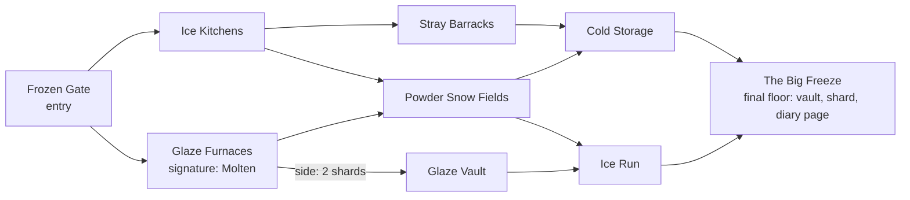

# Dungeon structure design

Status: built on branch `dungeon-structure` (waves W1 to W7b, verified in W8 on
2026-10-05), not yet playtested. **Owner decisions D23 to D41 (2026-10-06) in
`docs/plan-2026-10-06-2.md` change parts of this design** (D5, D8, D11, D12,
D13, D14, D16, D16a among them); that plan lists the amendments to make here
as it is built. Until then, where the two disagree, the plan wins. Decided with the owner on 2026-10-04 and
2026-10-05 in an interactive questionnaire. Sections 1 to 8 are the design as
decided (section 1 describes the code before this branch); sections 9 to 12 are
the as-built notes the builders wrote, and the verification result is in
`plans/COMPLETED-MILESTONES.md` ("Dungeon structure") with the live checks owed in
`docs/playtests/LIVE_CHECKS.md` L24 to L37. This document is also the frame the
room and theme audit runs against.

Sources: playtest `docs/playtests/2026-10-04-1.md` (curiosity threads, quotes,
agenda evidence), `2026-10-02-2.md` (campaign, Herobrine boss, vertical endless
mines), `AGENDA.md` (A2, A3, A6, A7, A8), `AUDIT_2026-09.md` section 11,
`docs/reference/THEMED_MERCHANTS.md`, `docs/ZONES_SPEC.md` (Endless Mine),
`docs/reference/LORE-STORY.md`, and the code cited in section 1.

## 0. The problem, in the owner's words

- "Seems weird that I started in a deepslate dungeon, then quickly went to
  frostworks, then basalt foundry, now I'm already entering Ender Archive,
  seems like I'm progressing very quickly through the story."
- "The progression works but seems weird, I like that I have to gamble my
  success on the run for more reward, but the floors in a set seem kind of
  disconnected."
- "It should map to typical minecraft playthroughs ... end seems like it should
  [be] pretty far into the game."

## 1. How a trip works today (verified in code)

| Part | How it works | Code |
|---|---|---|
| Theme per floor | Every door offers a different theme, drawn (weighted, deduped) from the current theme's `next` list. So every floor changes theme. This is the cause of "disconnected". | `AdventureGraph.pick`, `Keystone.offers`, `data/pocketdungeons/dungeon_adventure/*.json` |
| Theme graph | 12 nodes. `deepslate` and `prismarine` are `entry`, `drowned_vault` is `boss` (Drowned Warden capstone, resets to an entry theme), the rest `descent`. `currentTheme` and `depth` persist in `DungeonLog` across trips and banks. | `AdventureGraph.Kind`, `DungeonLog.recordTheme` |
| Zone unlocks | `rules.unlock_level` exists, but no theme file sets it, so every zone is open at keystone 1. Deepslate (an entry) lists `ender_archive` and `basalt_foundry` as next. This is why the End came early. | `ZoneRules.unlockLevel`, theme files |
| Doors and steps | Door 1 is +1 and free; door 2 is +2, needs keystone 7 and 3 shards; door 3 is +3, needs keystone 15 and 3 shards. The floor runs at keystone + step. | `Keystone.offers`, `KeystoneMath.upgrade`, `door2MinLevel`, `greaterDoorMinLevel`, `fuelCostPerGreaterDoor` |
| What the level does | Mob scale (0.65 + 0.8% per level), loot tier (1 to 4 at tier 1, 5 to 9 tier 2, 10 to 19 tier 3 diamond, 20+ tier 4 netherite), seeded affix count (1 from level 5, 2 from 25, +1 per 20). The keystone is fixed for a whole trip; it only changes at a bank. | `DifficultyProfile`, `KeystoneMath.lootTier`, `AffixMath.seededCount` |
| Banking | Sum of cleared floors' chart scrap, converted 5 to a chart at home; leftover scrap is lost. A floor beneath a member's compass pays less (scrap minus level gap, floored at 0). | `IntervalBanking.settle` |
| Echo shards | 0.5 chance per member on every floor clear (still in code although the owner asked on 2026-10-02-2 to remove it), 1 per full trip at bank, 0.25 per Ordeal per player, 1 for a short trip ended on the free door. | `RunLifecycle` (floor roll near line 1221, bank near 1451), `Ordeals` |
| Endless Mine | A Cube recipe (raw iron, keystone 5) forces the `endless_mine` theme for the trip: no final floor, loot tier +1 every 3 floors, materials role. | `cube_recipe/endless_mine.json`, `EndlessMineRules`, `ZONES_SPEC.md` section 3 |
| Rooms | 61 rooms; 10 are bound to themes by a `theme` field, 51 are generic and reskinned by the theme's processors. A cell is 16x7x16. | `dungeon_room/*.json`, `RoomSelector` |
| Breaking blocks | Inside a dungeon cell, only the shell is protected. Any interior block breaks with the correct tool ("right tool for the job"), and a player can always break their own placed blocks. | `RoomProtection.beforeBlockBreak`, `DungeonTools.isCorrectTool` |
| Light | The dungeon biome is `the_void` (no natural spawn list), so darkness alone spawns nothing. Trial spawners ignore light. Wolves need light to spawn (likely cause of PD-145). | `dimension/void.json`, `dimension_type/void.json` |

## 2. Vocabulary

| Word | Meaning | Replaces |
|---|---|---|
| Dungeon | A named graph of floors with one theme identity, one entry floor and (usually) a final floor. Each dungeon is one of Steve's memories. | a theme, a "set" |
| Floor | One generated level of cells, as today. In the graph, a floor is a **node**: a named floor variant of its dungeon (say Frostworks' "Ice Kitchens"). | unchanged |
| Trip | Leaving home until you bank. **One trip is one dungeon attempt.** | interval (code), set (player text) |
| Room | One cell on a floor, as today. | unchanged |
| Act | A group of dungeons that stands for one stage of a vanilla playthrough, closed by a capstone. | new |
| Capstone | The final dungeon of an act; clearing its final floor opens the next act. | the `boss` node kind |
| Main path / side branch | An edge between floors that is free / costs echo shards. | Greater doors |
| Resource node | A block a player may break: ore, log, harvestable. Everything else in a room is unbreakable. | "right tool for the job" on any block |

"Set" and "interval" are retired from anything a player reads. `interval`
can stay as a code name.

## 3. Decisions

Decided by the owner choosing an option. Items first written as proposals were
confirmed by the owner on 2026-10-05.

### 3.1 Unit of play

- **D1. One trip is one dungeon.** The first door picks the dungeon. Going home
  at any staging room banks what was cleared and ends that attempt; the final
  floor ends it naturally. The next trip starts at a dungeon's entry again.
  There is no saved position inside a dungeon.
- `floorsPerSafeVisit` stops being the trip length (each dungeon has its own
  length). It stays as the **banking divisor** (3), so a level means the same
  thing in every dungeon.

### 3.2 Graph shape and doors

- **D2. Length varies by dungeon.** Each dungeon declares its own layers.
  - **Limits**: 3 to 6 layers; at most 3 edges
    out of a floor (the staging room has three doors); branches may rejoin
    (bounded authoring; a pure tree doubles each layer).
- **D3. A door is a branch.** Each door leads to one next floor.
- **D4. Steps are dealt at random and free.** At each staging room the doors
  get +1, +2 and +3 in a seeded shuffle (stable while the preview is open). The
  step still sets the floor's level (keystone + step) and what it banks. No
  shard cost and no keystone gate on any step. `door2MinLevel` and
  `greaterDoorMinLevel` go away.
  - **Spare doors:** a floor with fewer than 3 edges out fills the spare doors
    with the same branch at the other steps, so the risk choice never vanishes.
- **D5. Echo shards buy side branches.** Each edge is authored as main (free)
  or side (costs N shards, typically 1 or 2). Every non-final floor must have
  at least one free edge out (a pack validator rule). Greater doors, their tier
  and the free door's shard payout are removed. Steps are the risk; shards are
  the route.
- **D6. The staging room shows the whole dungeon map**: the graph, where you
  are, the final floor, each edge's shard cost and what each branch can reach.
  Each door shows floor name, step, affix, loot tier and shard cost. Steps of
  later floors are hidden until you get there (rolled on arrival). This also
  answers the 2026-10-02-1 ask for diagrams over text on the go-home screen.

- **D6a. One main theme; floors and rooms may deviate a bit.** Every kind of
  dungeon (dungeon, capstone, endless) has one main theme, but a floor
  or a room may come from another dungeon's theme as long as it still fits:
  a Mineshaft with a Lush Cave floor or a flooded drift, a Frostworks dungeon
  with a Deepslate barracks floor. The main theme sets the dungeon's name,
  identity and node palette; a deviating floor or room keeps its own look.
  - **Guardrails** (confirmed 2026-10-05): a deviation only borrows from
    a dungeon of the same act or an earlier one (no Nether floor in Act 1);
    the loot band, node tiers and merchant currency follow the dungeon's act
    and main theme, not the borrowed theme; the entry and final floors always
    use the main theme, so the dungeon opens and closes as itself.

### 3.3 Progression and the campaign

- **D7. Five acts, each dungeon a memory of Steve's adventures, the acts are
  his playthrough in order.** This fits `LORE-STORY.md`: the shallow chaos stays
  as flavour (relocating rooms, anomaly rooms) and each dungeon is one of the
  "nodes of something almost whole".

| Act | Steve's memory | Dungeons | Capstone |
|---|---|---|---|
| 1 First Iron | his first caves | Mineshaft (new), Rootworks (to become Lush Caves), Infestation, Ossuary | The Spawner Dungeon: a vanilla cobblestone spawner crypt at scale, cave spider and skeleton brood |
| 2 The Deep | diamonds, trial chambers | Deepslate, Copper Works, Frostworks, Cow Pits (new) | Ancient City: a stealth floor where every sculk raises omen; the Warden is a threat you must not wake |
| 3 The Monument | diamond gear, the sea | Prismarine, Drowned Vault | Drowned Warden (exists) |
| 4 The Nether | the portal, fortresses, bastions | Basalt Foundry, Blackstone | The Wither (`wither_loft` exists as a room) |
| 5 The End | the stronghold, the Dragon | Ender Archive, then the End (new) | Steve/Herobrine |

- **D8. Clearing an act's capstone unlocks the next act.** Keystone level never
  gates access. Needs a per-player "acts cleared" record.
- **D9. Ending: escape now, seal later.** At the Act 5 capstone Herobrine
  nearly wins, Alex saves the player (her first appearance in person, answering
  the diaries) and he escapes. The post-campaign modes are the search. A later
  endgame capstone is the lore's seal.
- **D10. The act sets the loot band; the keystone sets difficulty.** Each act
  caps loot and node tiers (Act 1 stone and iron, Act 2 iron and diamond, Act 3
  diamond, Act 4 netherite, Act 5 top). Keystone + step still sets mob strength
  and affixes and moves loot within the band. One global keystone, same
  banking. Replaying an old act pays its materials, never late gear.

### 3.4 Rewards

- **D11. Finishing a dungeon pays the guaranteed echo shard plus a themed vault,
  and on first clear the dungeon's diary page.** This replaces "1 shard per full
  trip", and the per-floor shard roll is removed. Going home early banks what
  the floors paid but no shard, no vault, no page.
  - **2026-10-05 rework: chart scrap, charts and the compass.** Player-facing,
    the keystone is the **compass**. A door's step is dealt as **chart scrap**
    (still 1 to 3, still sets the floor's level). Five scrap make one **chart**;
    scrap only lives inside the dungeon, so going home converts what you carry
    into whole charts and the remainder is lost (the go-home confirm says both
    numbers). Each chart raised the compass one level, so banking slows to about
    a chart per typical trip. A floor far beneath a member's compass pays them
    less: `scrap - (member level - floor level)`, floored at 0, settled per
    member. Carried progress between trips is gone.
  - **Promised rewards.** A node may author `rewards` (item and count); the
    door advertises them and a copper chest on the reward floor holds them.
    The three completion chests are one barrel holding every roll (the finish
    vault's rolls merge into it too). A cleared floor's reward corner is two
    containers: barrel and copper chest.
  - **The door board** is one layout for every door, main and side alike, as
    two displays (a title at scale 2.0, a body at 1.6; revised 2026-10-06, see
    `design-2026-10-06-1.md` item 1). Title: `DUNGEON * floor N of M` (yellow;
    the Endless Mine has no M). Body: the floor's name in white with its
    affixes in magenta; a cyan line of what you get (scrap, or `too easy` in
    gray, a resource dungeon's ore as plain words, the floor's promises, and on
    the last floor the shard, the vault and the diary page while it is still
    owed); `loot xN` in green, followed by `costs N echo shards` in yellow when
    the door has a price. Dark, dim and experimental floors add a line. The
    separator is a middle dot. No labels: colour does the grouping.
  - **The GO HOME board** is the same split (title 1.0, body 0.8): `GO HOME`
    (green once the dungeon is cleared), the scrap carried in cyan, and what it
    comes to: `2 more for a chart` (gold), `1 chart` (green), `2 scrap lost`
    (gray), or `no scrap yet`.
- **D12. A dungeon's resource nodes are flavour; the Mineshaft has the most.**
  Revised 2026-10-06 (plan 2026-10-06-2 G): the resource kind is retired. Every
  dungeon pays scrap, and its finish pays emeralds, the vault and the page.
  A dungeon that leans on its nodes declares `minNodeRooms` (a per floor count,
  a node may override it): the Mineshaft sets 1, the Cow Pits sets 1 for its
  pens. 2 to 6 floors, finite nodes, mobs and omen still live. Capped tool
  durability (pickaxes 12 to 16 uses) is the limit: a trip spends durability
  for ore. Node tiers follow the act band.
- **D13. The Endless Mine opens after Act 1, and each depth layer needs its
  act.** Depth layers per `ZONES_SPEC.md` 3.5; the shaft past Deepslate stays
  sealed until Act 2 is cleared, the magma core until Act 4. Banks like any
  dungeon, loot tier climbs every 3 floors within the layer's band, ends when
  you bank or fail, and the deepest floor goes on the history board. It stops
  being a Cube recipe.

### 3.5 Existing systems

- **D14. Five starting kits, granted once, no refills.** The 9 bags are cut to
  5 (which five is an audit question). Kit top-up and the bag chest refill are
  removed (L23 retires). Resource dungeons are the restock.
- **D15. Party: the leader's progress sets the choices; any member can act.**
  The leader's unlocked acts decide which dungeons and branches are offered. Any
  member can pull a door lever, choose a branch or pull HOME. A leader setting,
  **whitelist only**, limits those decisions to listed members (joining is
  unchanged). Each member banks from their own key, as today.
- **D16. Every member present at a capstone clear unlocks the next act**, so a
  friend can be carried.
- **D16a. Defaults for the other systems** (confirmed 2026-10-05):
  - Affixes: a floor node may declare a signature affix ("Glaze Furnaces" is
    always Molten); otherwise affixes are seeded as today.
  - Omen: per trip as today. A capstone floor starts with omen on it.
  - Themed merchants: named for what they buy (owner direction, 2026-10-04
    04:03), stock from the dungeon's mobs.
  - Store and Altar stay ordinary rooms in each dungeon's pool. Run storage was
    unchanged here; revised 2026-10-06 (`design-2026-10-06-1.md` item 5): it is
    now Dungeon Storage, 27 slots per player saved in `DungeonLog`, never emptied
    by a teardown or a logout (the auto-return and its offline notice are gone).
    An omen death still rolls it back to the interval's start, closing an open
    menu first. Whatever an old live run's storage still held moves into it.

### 3.6 Rooms, light and resources

- **D17. Spookier rooms.** Narrower corridors and less light where it fits,
  rooms still able to be 4-way.
- **D18. Biome rooms that fit the dungeon.** Lush Cave rooms in a cave dungeon
  instead of a forest; a Warped Forest room in an outdoor Nether dungeon.
- **D19. Mineable blocks become resource nodes, themed to the dungeon.** Lush
  caves: oak logs. Warped forest: warped stems. Mineshaft: iron, gold, copper,
  coal and diamond ore.
- **D20. The interior is mineable with the correct tool; the shell never is.**
  Reverted 2026-10-05 (playtest 2026-10-05-1: the playtester rejected the
  node-only rule). The cell shell is a separate, earlier protection, so
  mineable interiors cannot tunnel between rooms. Ordeal fixtures stay
  unbreakable; a player's own blocks break with any tool.
- **D21. Fewer torches, more planks and coal** in loot and rooms, so light is
  something the player crafts and places.

### 3.7 Scope

- **D22. First playtest is the mechanics on existing themes (Stage 1),** before
  any new content. See section 6.

## 4. Example dungeon graph: Frostworks (Act 2)

Five layers, widths 1, 2, 3, 2, 1. One side branch costs 2 shards and is the
only way into the Glaze Vault floor. Branches rejoin before the final floor.
Steps (+1, +2, +3) are not drawn: they are dealt at random at each staging room.



ASCII, for the staging room map:

```
 L1           L2                L3                    L4            L5
                                                       
[Frozen Gate]-+-[Ice Kitchens]--+-[Stray Barracks]----+-[Cold Storage]-+
              |                 +-[Powder Snow Fields]-+                |
              +-[Glaze Furnaces]+                      +-[Ice Run]------+-[The Big Freeze]
                                +==2==[Glaze Vault]----+
 
 --- main path (free)    ==N== side branch (N shards)
```

D6a in this example: Stray Barracks could be a Deepslate floor (an Act 2
neighbour) inside Frostworks, while the Frozen Gate and the Big Freeze stay
Frostworks.

Glaze Vault is reachable only by taking Glaze Furnaces at layer 2 and paying 2
shards at layer 3: "some floors are only reachable through earlier choices".
Shortest finish is 5 floors; a trip that banks after floor 3 never sees the
final vault.

## 5. Open questions

1. Resolved 2026-10-05: graph limits and the spare doors rule are confirmed
   (D2, D4).
2. With free random steps, does a strong player always take +3? The price is
   danger (mob scale, affixes, omen fail), not currency. Watch it (A6).
3. Is a node authored (named floor with its own room bias and size) or
   generated from the dungeon's room pool with a name only? Authored is richer;
   generated is cheaper for Stage 1.
4. Shard income after D5 and D11: about 1 per finished dungeon plus about 0.25
   per Ordeal. Enough for one side branch per dungeon? Set side costs after the
   Stage 1 playtest.
5. Steps on a final or capstone floor: random like any floor, or fixed (say +3)?
6. Capstone fights must be server-side with vanilla mobs: the Spawner Dungeon
   brood, the Ancient City Warden (never spawned in the dungeon per
   `ZONES_SPEC.md`; needs a ruling), the Wither (block damage vs the D20 break
   rule), and the Herobrine fight and Alex's rescue.
7. Endless Mine height: the dimension is y 0 to 256. `ZONES_SPEC.md` 3.2's
   answer (restamp each floor at working height, sealed staging rooms) still
   applies; confirm when building.
8. Darkness and wolves: Feral and kennel rooms need light for wolves (PD-145).
   Dark rooms must not host them, or the wolf spawn needs its own light.
9. Cow Pits: cows breed with wheat, so "finite" needs a rule (no wheat in the
   floor, or breeding blocked). What it pays (beef, leather) and its act.
10. Which five kits survive (audit).
11. Diary pages: 7 exist (`data/pocketdungeons/diary`); D11 needs one per
    dungeon, about 15.
12. Migration: `currentTheme` and `depth` in `DungeonLog` become meaningless;
    existing saves need a reset rule. Players past keystone 7 or 15 lose nothing
    (the gates are gone).
13. Where the loot band numbers per act sit (tiers per act, D10), and how node
    tiers map to tool tiers (a wooden pickaxe cannot mine iron ore, by design).
14. The Endless Mine's place in the act table: the history board's "deepest
    floor" needs a home in the UI.
15. Floor level is compass plus step, so a solo player is never above a floor
    and the too easy discount never bites solo. Authored fixed floor levels, or
    a per-dungeon levelCap, would make it real. Deferred 2026-10-06.

## 6. Staged implementation outline (no code)

**Stage 0, before anything else.**
- Remove the per-floor shard roll (`echoShardFloorChance` to 0), as already
  asked on 2026-10-02-2.
- Fix the "inaccessible rooms" first (PD-143, PD-144, PD-145, PD-140), since
  the audit and D20 both depend on rooms being passable.

**Stage 1: mechanics on existing themes (the first playtest).**
- A `dungeon` data type: id, name, act (unused yet), layers, nodes (name,
  room bias, optional signature affix, optional room count), edges (from, to,
  shard cost). Replaces `dungeon_adventure` for door offers.
- One dungeon per existing theme, 3 to 5 layers, nodes as named variants of
  the theme's room pool.
- First door of a trip picks a dungeon; later doors are the current node's
  edges. Random seeded steps; side-branch shard cost; at least one free edge
  (validator).
- Staging room map (D6) and door labels.
- Finish pays shard + vault (+ page if one exists). Bank stays sum / 3.
- Retire Greater doors, door gates, the free door's shard and the trip-length
  meaning of `floorsPerSafeVisit` in player text.
- Journal events: dungeon chosen, node entered, edge taken (cost), step dealt,
  finish or bank-early, floor seconds. These feed section 8.

**Stage 2: the Act 1 slice.**
- Resource node system and the D20 break rule.
- The Mineshaft (resource dungeon) and Rootworks rebuilt as Lush Caves.
- Narrow and dark room pass on Act 1 rooms (D17, D21).
- Acts and the capstone gate; the Spawner Dungeon capstone; act loot bands
  (D10).
- Kits cut to 5, refills removed (D14).
- Party decisions open to any member and the whitelist setting (D15, D16).
- Endless Mine opens after Act 1 (D13), upper workings layer only.

**Stage 3: Acts 2 and 3.**
- Deepslate, Copper Works, Frostworks, Cow Pits; Ancient City capstone (sculk
  stealth from the 2026-10-04 sensor_gallery thread).
- Prismarine and the Drowned Vault as Act 3 with the existing Warden.
- Endless Mine deepslate and deep dark layers.

**Stage 4: Act 4.**
- Basalt Foundry, Blackstone, a Warped Forest room, Nether nodes; the Wither
  capstone. Magma core layer.

**Stage 5: Act 5 and the campaign end.**
- Ender Archive, the End, the Herobrine fight and Alex's rescue; post-campaign
  modes framed as the search.

## 7. What this changes in the room and theme audit

Audit every room and theme against these questions:

- Which dungeons can this room appear in, and does it fit that memory?
- As a borrowed room (D6a), which other dungeons' main themes does it still
  fit?
- Which graph role does it suit (entry, ordinary, side-branch reward, final,
  capstone)?
- Does it still work when only nodes break (D20)? A room that relied on
  digging, or that provides blocks by being dug, must be rebuilt or provide
  nodes.
- Can it be narrower and darker (D17, D21), and does it need light for a
  mechanic (wolves, kennels, sculk readability)?
- Which resource nodes does it hold, and of which tier for its act?
- Is it a generic room that would repeat across a 5-floor dungeon?

New or changed room metadata fields (names are suggestions):

| Field | Purpose | Notes |
|---|---|---|
| `dungeons` (list) | Which dungeons may use the room as a main-theme room | Replaces and generalises `theme`; empty means any dungeon in the room's acts |
| `borrowableBy` (list) | Dungeons that may use the room as a deviation (D6a) | Optional; the default is the guardrail rule (same or earlier act) |
| `acts` (list) | Which acts the room belongs to | Lets a generic room be limited by vanilla stage |
| `graphRole` (list) | `entry`, `any`, `side_reward`, `final`, `capstone` | Final and capstone rooms hold the vault or the fight |
| `nodes` (list) | Resource nodes: block id, position or volume, count, tool tier | Drives D19 and D20; validator checks tier against the act band |
| `light` | `lit`, `dim`, `dark` | Darkness pass; validator warns on `dark` with wolves or a kennel |
| `corridor` | `narrow` or `wide` | Narrow rooms still declare their door mask (4-way allowed) |
| `biome` | e.g. `lush_cave`, `warped_forest`, `mineshaft` | Biome rooms per D18 |
| `provides` | existing | `blocks` now means "has block nodes", not "has diggable walls" |
| `requiresLight` | boolean | Wolves, kennel, any mechanic that needs a light level |

New or changed theme / dungeon fields:

| Field | Purpose |
|---|---|
| `act` | 1 to 5, the act the dungeon belongs to |
| `kind` | `dungeon`, `capstone`, `endless` (legacy `story` and `resource` parse as `dungeon`) |
| `minNodeRooms` | node rooms a floor must place, default 0; a node may override (D12) |
| `lootBand` | min and max loot tier for the act (D10) |
| `layers`, `nodes`, `edges` | the graph (section 6, Stage 1) |
| `nodePalette` | the resource node blocks the dungeon uses (D19) |
| `mainTheme` | the dungeon's identity: processors, name, entry and final floors (D6a) |
| node `theme` | optional per-floor theme override for a deviating floor (D6a) |
| `deviation` | how often a floor or room may come from another theme, and from which (D6a) |
| `merchant` | named by what it buys, not by theme |
| `diary` | the page a first clear grants (D11) |
| retire `rules.unlock_level` | access is by act (D8) |
| retire `dungeon_adventure` | the per-theme transition graph |

Themes into dungeons: all 12 current themes keep a place (section 3.3).
`endless_mine` becomes the Endless Mine mode, not a dungeon. `rootworks` is the
natural one to rebuild as Lush Caves. New: Mineshaft, Cow Pits, the End, and
the Spawner Dungeon, Ancient City, Wither and Herobrine capstones.

## 8. Risks and what the Stage 1 playtest must learn

The owner chose four hypotheses for the first playtest:

| Hypothesis | Agenda | Evidence that answers it | Would change our mind |
|---|---|---|---|
| The dungeon feels connected | A6 | Unprompted comments on theme and place; whether he can name the dungeon and its floors after a trip | "Still feels random", or one theme over 5 floors feels samey (51 of 61 rooms are generic) |
| Finishing pulls | A7, A2 | Floors per trip (today always 3), why he went on or went home, the finish vault and page comments | He still banks at 3 and never finishes: shorten dungeons or move the vault earlier |
| Length is right | A8 | Floors per dungeon, seconds per floor (today 218 to 828 s, floor 1 slowest) | A full dungeon does not fit a sitting (more than about 45 minutes): shorter floors, not fewer layers |
| Shards buy branches | A3, A6 | Shards held at each staging room, side branches taken, shards left unspent | Never affordable (raise income) or always taken (raise cost) |

Further risks to watch:

- Random steps may read as arbitrary ("the floor I want rolled +3"), or +3 may
  be taken every time because it is free.
- D20 makes a room that needed digging impassable; the owner's fix-first
  concern ("inaccessible rooms") gets sharper.
- Resource dungeons may be farmed if durability is not a real cost (watch
  ore mined per trip against durability spent).
- Party: any member pulling HOME can end a trip others wanted to continue; the
  whitelist is the answer, watch if it is needed.

## 9. As built: wave W4 (resource nodes, the break rule, light)

What a player can break inside a dungeon cell (D20). The shell (floor, walls,
ceiling) never breaks, and neither does an Ordeal's lever or lamp. In the
interior only these break, decided by `BreakRule`:

1. **A block the player placed**, with any tool, as before.
2. **A resource node**, with the correct tool tier (the existing
   `DungeonTools.isCorrectTool`). A node is a position registered at stamp time:
   a room metadata `nodes` entry, or any interior block of the floor dungeon's
   `nodePalette` that the template already holds. Registered per floor on
   `FloorState.nodes`, removed when mined, gone at teardown.
3. **A soft mechanic block**, with the correct tool, because a room's puzzle
   expects the player to break it. Kept breakable:

| Block | How it stays breakable | Why |
|---|---|---|
| Decorated pots | block tag `pocketdungeons:dungeon_breakable` | frame_lock, pot_room, the Infested Wall's pickaxe pot, sorting_floor |
| Cobweb | the same tag | thicket |
| Infested blocks | the same tag | the Infested affix and the Infested Wall |
| Infested wall doorway plug (infested bricks and the stone bricks above) | positions registered by `LayoutStamper` (`InstanceLayout.softBreakables`) | the wall is stone, so a tag would free every stone block |
| Elder's Chamber gravel plug | the same registered positions | the soft wall out of the flooded room |
| Loose stone, gravel, dirt and wool a room provides (`provides: blocks`) | room metadata `nodes` in flow_puzzle, gallery, ropewalk, sorting_floor, sump, sensor_gallery | the player carries them to bend water or mute sensors |

Unchanged: creative bypasses the rule; rubble is still cleared only by a blast
(it sits in the shell, and `ServerExplosionMixin` lets only the rubble blast
through); the PD-62 iron door far side slots stay breakable and placeable; the
collapsing bridge and trap blocks are changed by their own handlers, never by a
player break; the sculk sensors in sensor_gallery work by vibration and are not
broken by design. A refused break shows a throttled action bar line, "Only
resource nodes can be mined here".

Light (D17, D21): `light` is `lit`, `dim` or `dark` per room, and an optional
`light` on a dungeon node sets a minimum darkness for every room on that floor.
`dark` removes torches, lanterns, soul variants, glowstone, sea lanterns, jack o'
lanterns and redstone lamps at stamp time; `dim` removes every second one in x,
y, z order. A room with `requiresLight: true` is never darkened (kennel_crossing
and creeper_kennel are marked). The Feral affix is not dealt on a dark node.
Chest tables: torches are a third as likely (a random chance on the torch entry
or pool), and the non ominous tier and supply tables carry more planks and coal.

Left for later waves: marking rooms dark (W6), authoring biome rooms and node
decoration (W6, W7), and the room selector reading `dungeons`, `acts`,
`graphRole` and `borrowableBy` (parsed and validated now, not yet used to pick).

## 10. As built: wave W6 (resource dungeons, Lush Caves, Endless Mine)

- **Mineshaft** (act 1, resource, 3 layers, no diamond), **Cow Pits** (act 2, resource, 2 layers) and
  **Lush Caves** (the `rootworks` id, renamed for players). A resource dungeon may be 1 to 3 layers
  (`DungeonDef.problems`); its first finish now hands over its diary page (no shard, no vault).
- **Cow Pits finite rule**: adult cows only (`CowPits`, entity tag `pocketdungeons_cow`), wheat is refused
  by a use callback, any baby cow in the dungeon dimension is removed, and the Cow Pits loot tables
  (`*_cow_pits`, also the supply tables, which `TrialContent` now resolves with the theme suffix) are filtered
  copies with no wheat, seeds, carrots, potatoes, hay or bread. The 6 to 10 cap is the room set:
  `cow_pens` 3 cows x 2, `hay_loft` 2, `cow_yard` 2 (`CowPits.ROOM_COWS` and the rooms' `maxPerDungeon`).
- **Narrow pass**: the generic halls are shared by every act, so they were left alone. Act 1 got dedicated
  narrow rooms with a 3 wide path (z 6 to 8) between the doorway lanes: `mineshaft_tunnel`, `mineshaft_crossing`,
  `mineshaft_seam`, `mineshaft_collapse`, `lush_root_gallery`, `burrow_tunnel` (infestation), `ossuary_passage`.
  Existing Act 1 rooms `ossuary_crypt`, `rootworks_grove`, `thicket`, `crypt_corner`, `slime_pit` are `light: dim`.
  `shroomlight` now counts as a light source so Lush Caves rooms can be dimmed.
- **Endless Mine as a mode**: it **replaces door 3 of the first staging room** once act 2 is unlocked (Act 1's
  capstone clear; the three door UI has no slot for a fourth). The cube recipe file is removed. The door is
  the `endless_mine` dungeon's entry node; `EndlessMineRules.isMineOffer` flags the run Mine at commit.
  Layers: floors 1 to 5 (act 1), 6 to 11 (act 2), 12 to 17 (act 3), 18 and on (act 4). Entering a layer whose
  act is not unlocked seals the shaft: the interval is marked finished with `mineSealedAct`, so the staging
  room offers only HOME with a line naming the act. Loot tier: the layer band's minimum, plus one every 3
  floors into the layer, capped by the band (acts 1: 1 to 2, 2: 2 to 3, 3: 3, 4: 3 to 4). The deepest
  cleared floor is `DungeonLog.Campaign#deepestMineFloor` (codec key `deepest_mine_floor`) and shows on the floor
  history board.
- Templates for the new rooms are generated from `ResourceBiomeSpecs`; content from `tools/gen_resource_content.py`.

## 11. As built: wave W7a (the Act 1 and Act 2 capstones, the capstone offer rule)

**Capstone offer rule** (`TripDoors.pendingCapstone`, `TripDoors.dealFirst`, read in `Keystone.offers`).
A capstone of act N is offered only when act N is unlocked (`eligibleFirst` already filters by act). On
top of that, the first staging room of a trip carries the *pending capstone* on door 1 or door 2 (a seeded
pick of the two, never only door 3): the capstone dungeon of the lowest unlocked act whose capstone the
player has not finished (`DungeonLog.Entry#dungeonsFinished`). It is guaranteed every trip until it is
cleared, then the next act's capstone takes over once that act is open. Door 3 is excluded because the
Endless Mine (D13) and an operator's experimental offer both replace it. Only one capstone is guaranteed per
trip; a player holding several uncleared capstones (a migrated tester with acts 2 and 3 open) sees the lowest
first and the rest by the ordinary shuffle. Clearing a capstone's final floor unlocks act N+1 for every
member present (`RunLifecycle.finishDungeon`, `DungeonProgress.onCapstoneCleared`, unchanged since W3).

**The terminal cell holds the boss room.** `RoomEligibility.narrowToCapstone`: on the final floor of a
capstone dungeon, the cell asked for with the structural `exit` role draws only rooms whose `graphRole`
includes `capstone`, when any such room is eligible. Both new boss rooms are `exit` rooms with their own
exit pad, so the pad, the completion chests and the staging room behind the terminal work unchanged. The
Drowned Vault has no `capstone` room and keeps the plain exit hall and its ravager boss.

### The Spawner Dungeon (Act 1, `spawner_dungeon`, 3 layers, loot band 1 to 2)

Nodes: Cobbled Stair, then the Mossy Halls or the Bone Gallery (an Ossuary floor, D6a), then the Brood
Chamber. Theme `spawner_dungeon`: mossy cobblestone, trial spawners use the Mineshaft roster (zombies,
skeletons, cave spiders).

The `brood_chamber` room (`CapstoneSpecs`, content `brood_chamber`) is the terminal: four classic spawners on
mossy plinths around the pad. `CapstoneFights` gives them zombie, skeleton, cave spider and zombie in position
order, and registers each as a soft breakable block so a pickaxe may take it (D20 would otherwise refuse).
The gate is the same path as the Drowned Warden, `RunLifecycle.completeRun`, which now also asks
`CapstoneFights.padRefusal`. The pad stays shut through two stages (pure rules in `BroodWave`):

1. **Spawners.** Done when every spawner is broken, or when the party has killed
   `6 per spawner + 6 per extra member` brood mobs in the room (the cages are then doused: "exhausted").
2. **The final wave**, released when a member is in the room: `4 + 2 per extra member` skeletons and
   `6 + 3 per extra member` cave spiders, capped at 40 mobs. The pad opens when every wave mob is dead.

The watch tick (`Instances.onTick`) drives it; wave mobs carry a tag and are discarded when the floor ends.

### The Ancient City (Act 2, `ancient_city`, 4 layers, loot band 2 to 3)

Nodes: Buried Gate (dim), then the Silent Avenue or Echo Cloister, then the Deepslate Barracks (a Deepslate
floor) or the Sensor Hall, then the Warden's Rest. Every node after the gate is `dark`. Theme `ancient_city`:
deepslate tiles, polished deepslate, soul lanterns. Rooms: `sculk_causeway` (2 doors), `sculk_nave` (4 doors),
both corridor rooms, and the boss room `warden_hall` (`graphRole: capstone`).

**Every sculk activation raises omen** (`OmenSources.arm`, `SculkOmen`): on a floor whose theme is
`ancient_city` every sculk sensor and shrieker in every cell is armed whatever the room's `pressure` says. A
sensor pulse is worth one omen (elsewhere one per five), a shriek one omen as before. All shriekers are
authored with `can_summon` false, so vanilla never raises a Warden from one.

**The Warden** (`CapstoneFights.tickWarden`): on the final floor, when the floor's omen reaches
`Omen.MAX_OMEN` (4), one real vanilla Warden is spawned with the emerging pose, at a clear spot in the cell of
the first online member at least six blocks from them, and set on that member (anger 80). It is exempt from
the keystone mob scaling. **It does not gate the pad**: the floor completes by reaching the terminal pad. The
Warden is discarded when the floor ends (`RunLifecycle.advanceFloor`) and when the instance is torn down
(`InstanceTeardown`). `SculkOmen.wardenAllowed` is true only for the Ancient City, and
`CapstoneFights.fightOf` only returns the Warden fight there; `ZONES_SPEC.md` keeps "never spawned" for the
Endless Mine.

Diary pages: `entry_16` (Spawner Dungeon), `entry_17` (Ancient City), `entry_18` (Prismarine) and `entry_19`
(Drowned Vault), wired by each dungeon's `diary` field.

D16a's capstone start omen and the Wither (Act 4) and Herobrine (Act 5) capstones were built in W7b (section 12).
Templates are generated by `CapstoneSpecs`.

## 12. As built: wave W7b (the Nether and End capstones, forests, the capstone omen)

**Capstone start omen (D16a).** The final floor of every capstone dungeon opens with
`capstoneStartOmen` omen (config, default 1, 0 to 4; 0 turns it off). `CapstoneStart` is the pure rule;
`Instances` applies it at floor commit on the zone head start path (`Omen.Source.DEPTH`, so the bar and cue
say so). It only ever raises the floor's omen. The Ancient City's Warden still waits for omen 4.

**Warped and crimson forests (D18, D19).** `warped_forest` (4 doors) and `crimson_forest` (2 doors, west and
east), both `light: dim`, `acts: [4]`, for `basalt_foundry`, `blackstone` and `wither_keep`. Four or five stem
trunks with wart block canopies (nodes: `warped_stem`, `warped_wart_block`, `crimson_stem`,
`nether_wart_block`, declared in the room metadata), shroomlight on at most three canopy corners.
`soul_sand_valley` (2 doors, `wither_keep`) holds a basalt outcrop with nether quartz nodes. The Act 4 story
dungeons gained the four forest blocks in their `nodePalette`, a grove node biased to the forests
(`warped_grove` in Basalt Foundry, `crimson_grove` in Blackstone) and a diary page each (entries 20 and 21).

### The Wither (Act 4, `wither_keep`, 4 layers, loot band 3 to 4)

Nodes: The Soul Gate, then The Fortress Bridges or The Warped Grove, then The Skull Cellars or The Blaze Spire
(a Basalt Foundry floor, one shard side edge from the bridges), then The Wither's Throne (`wither_hall`,
`graphRole: capstone`, an exit room with its own pad). Theme `wither_keep`: nether brick and soul soil
processors, wither skeleton and blaze trial spawners, the Basalt Foundry loot tables.

- **Summon** (`WitherFight`): the watch tick wakes one real vanilla Wither at the east end of the room when
  a member first stands in it. Max health `240 + 120 per extra member`, capped at 720 (`WitherRules`), set on
  the max health attribute, exempt from the keystone mob scaling (`CapstoneFights.UNSCALED_TAG`, read by the
  `ENTITY_LOAD` scaler). It grows for its usual eleven seconds and then blasts; players are told to stand back.
- **No block damage.** The spawn blast and the skulls explode through `Level.explode`, so
  `ServerExplosionMixin` already stops them breaking blocks inside a dungeon cell (entities are still hurt).
  The Wither's own box breaking (`destroyBlocksTick`, not an explosion) is stopped by the new
  `WitherBossMixin`, which zeroes the countdown in the dungeon dimension. Checked live: a Wither hurt inside a
  stone box breaks the box in the overworld and leaves it whole in the dungeon dimension.
- **Containment.** Every 4 ticks a Wither found outside the room (inset 1.5 from the cell edge, feet 0.5 to 2.5
  above the floor) is clamped back inside and its motion zeroed, so it cannot leave through the west door.
- **Gate.** `CapstoneFights.padRefusal` shuts the pad until the Wither is summoned and dead, the same path as
  the Drowned Warden and the brood. A failed spawn never locks the floor.
- **End of floor.** The Wither is discarded when the floor ends and at instance teardown.
- **Nether star: kept.** The vanilla drop stays. It is one per clear and a signature reward; the run inventory
  does not leave the dungeon, so a star only goes home if banked in a chest, and the loot band reward is the
  finish vault (two tier 4 chests, `finishDungeon`), unchanged. Clearing the throne unlocks Act 5.

### The End (Act 5, `the_end`, 4 layers, loot band 4)

A story dungeon. Nodes: The Outer Gate, The Outer Islands or The Chorus Orchard, then The End City, The
Stronghold Stacks (an Ender Archive floor) or The End Ship (one shard side edge), then The Rim of the World.
Rooms `end_island` (4 doors, chorus plants, an obsidian spire, diamond and debris nodes), `end_city_hall`
(4 doors, purpur pillars with end rods) and `end_ship` (2 doors, a hull, a brewing stand and a dragon head).
Trial spawners: endermen, shulkers, endermites. Diary entry 24.

### Herobrine (Act 5, `herobrine`, 4 layers, loot band 4)

Nodes: The Last Stair, then The Remembered Bastion (Blackstone) or The Remembered Stronghold (Ender Archive),
then The Seam, then **The Fracture** (`fracture_hall`, capstone, exit room with its pad). Ending the campaign
goes through `DungeonProgress.onCapstoneCleared` as for every capstone, which sets `campaignComplete`; its line
now ends "The search continues".

- **Steve** (`HerobrineFight`): a zombie named Steve (name tag hidden; the boss bar reads "Herobrine") in full
  netherite, no reinforcements, never loot, persistent, exempt from keystone scaling. Health
  `400 + 200 per extra member` (cap 1000), attack damage `2 + 0.5 per extra member` (cap 5) before the
  sword's own. Phases by health (`HerobrineRules`): melee above two thirds; summons (waves of endermen and
  wither skeletons, capped at 8 alive) above one third; blink (he teleports near a member every 70 ticks) below.
  Each phase has a title and a chat line.
- **Rescue.** Steve cannot be killed and no member can die to him. It fires on the first of: a member at 25 percent
  health, a member's killing blow (cancelled, health set to 15 percent), Steve at 10 percent health, Steve's
  killing blow (cancelled). The scene runs 430 ticks: the room hushes and the adds go; Alex appears (a vanilla
  mannequin with the slim default Alex skin, holding a recovery compass, invulnerable, the `StoreNPC` approach of
  a tagged vanilla entity); Alex and Steve speak (the bar renames to "Steve"); Steve vanishes in portal
  particles with a teleport sound; Alex gives the party a word, heals them with regeneration and vanishes; the pad
  opens. Nothing in the room hurts a member while the scene plays.
- **Gate.** `CapstoneFights.padRefusal` keeps the pad shut until the scene is over. Stepping on the pad then
  completes the floor and finishes the dungeon; the floor end discards Steve, his adds and Alex.
- Diary entry 25 is Alex's own words after the rescue.

**Legacy theme lists.** The W6 rooms gained a `theme` list beside `dungeons` (the legacy filter, still used by
the Endless Mine and admin builds, matches an empty list to every theme). The mineshaft rooms also name
`deepslate`, the Endless Mine's room theme, on purpose, so a mine floor draws mine rooms. The lush, cow,
burrow and ossuary rooms name only their own dungeon. The Endless Mine still draws every room with no `theme`
and no `dungeons` (the generic halls and the situation rooms), as before; narrowing that is a later audit.

Templates for the eight new rooms are generated by `NetherEndSpecs`; content by `tools/gen_w7b_content.py`.
Diary pages 20 to 25 (bands 25 to 30): Basalt Foundry, Blackstone, Wither, Ender Archive, End, Herobrine.
